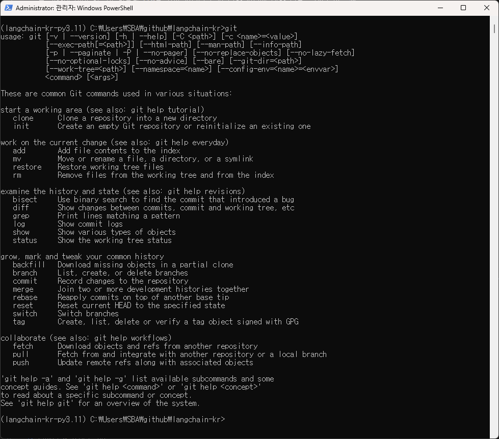
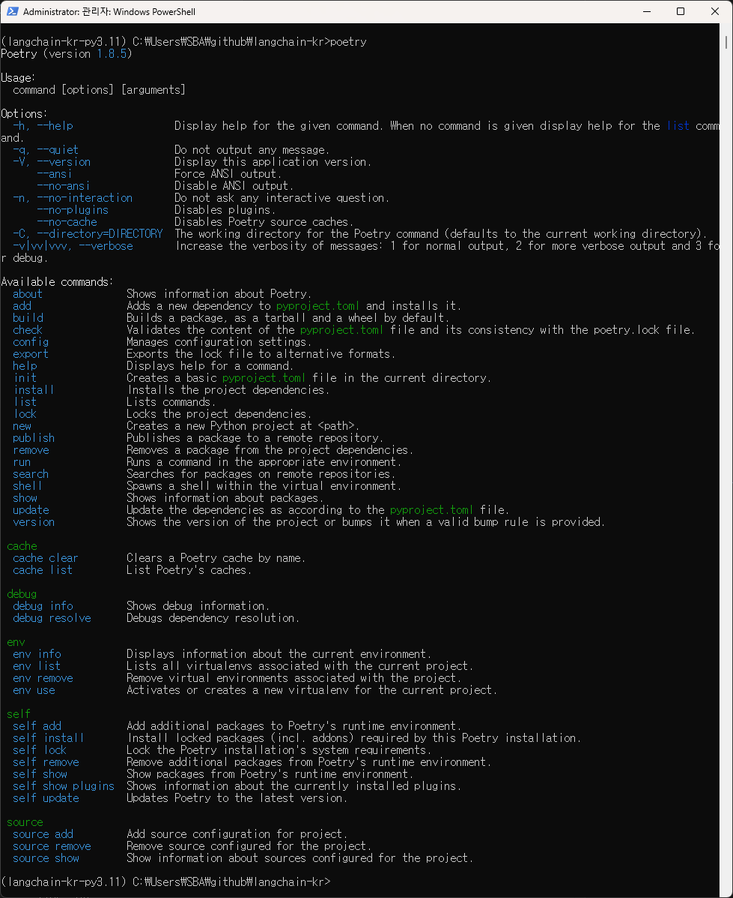
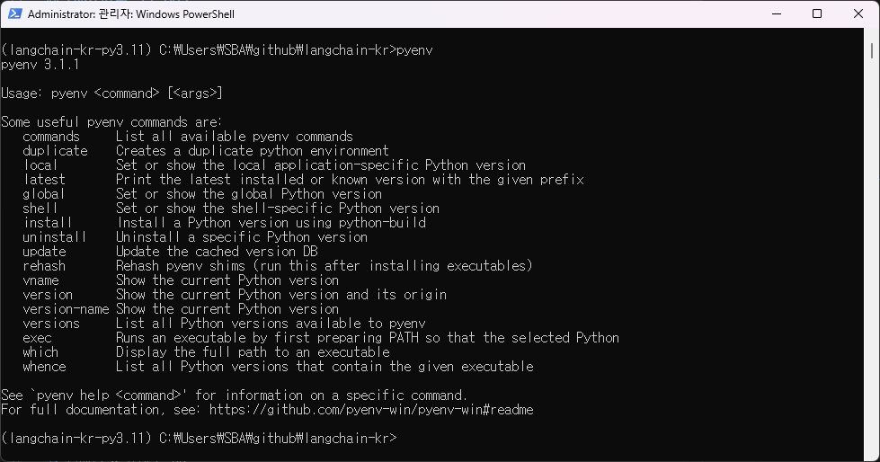

# 환경 설정 점검

## 1. Git 설정

## 2. Poetry 설정

## 3. Pyenv 설정

## Conda vs Pyenv + Poetry 간단 비교

## Conda vs Pyenv + Poetry 간단 비교

### Conda(아나콘다)
- **목적**: 과학 연산 생태계 + 패키지/환경 관리
- **가상환경**: `conda create -n env`
- **패키지 설치**: `conda install`, `pip` 혼용 가능
- **파이썬 버전**: Conda 자체 배포 파이썬 제공
- **재현성**: 환경 YAML로 공유
- **장점**: 데이터 과학 패키지(NumPy, SciPy 등) 설치 편리
- **주의**: 시스템 PATH 및 pip/conda 혼용 시 충돌 가능

---

### Pyenv + Poetry
- **목적**: 파이썬 버전 관리(Pyenv) + 의존성/가상환경 관리(Poetry) 분리
- **가상환경**: `poetry env use <python>`
- **패키지 설치**: `poetry add` (PEP 517/518 기반, 잠금파일 `poetry.lock`)
- **파이썬 버전**: Pyenv로 다수 버전 설치/전환
- **재현성**: `pyproject.toml` + `poetry.lock`로 버전 고정
- **장점**: 가볍고 표준 파이썬/패키징 흐름에 가까움, 프로젝트별 깨끗한 격리
- **주의**: Windows의 “앱 실행 별칭”, PATH, 쉘 초기화 등 첫 세팅 주의

---

**요약**
- **Conda** → 데이터 과학 / 레거시 환경 호환에 강점  
- **Pyenv + Poetry** → 최신 표준 워크플로우, 재현성, 프로젝트 분리에 강점
